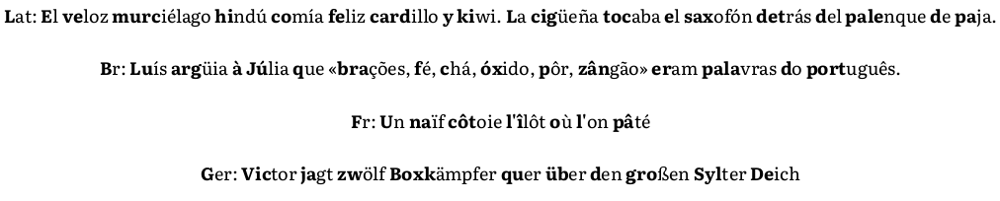

# Bioterata
Easy to read, Fast Reading Font

### Acknowledgement

- This font is a derivative work based off [Literata](https://github.com/googlefonts/literata). It features `Contextual Alternates` to support Fast Reading.

- Big kudos to [@Born2Root Fast Font](https://github.com/Born2Root/Fast-Font), for their step-by-step tutorial in creating a fast reading font.

### Motivation

Custom font creation learning, plus an easy to read font for my personal Kindle

### Future updates

Jan 2025 is the first public release of this font. It was created following the tutorial above with no intentions of further updates. Unless unsupported characters are reported, it will remain as is. Feel free to create an issue if so.
